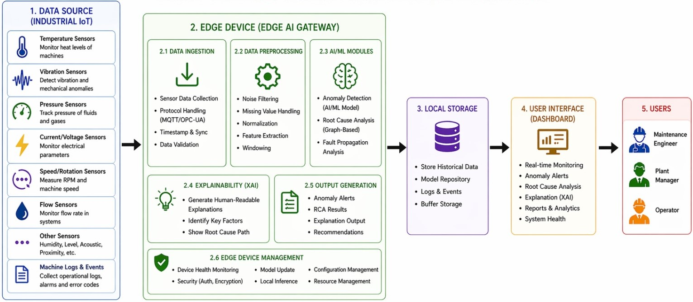

# 🔌 Universal IoT Root Cause Analysis (RCA) Platform

> An AI-powered real-time IoT monitoring system that detects anomalies and predicts root causes of device failures using live MQTT data streams.

---

## 📌 Project Overview

The **Universal IoT RCA Platform** is a full-stack, production-ready solution that monitors IoT devices in real time, detects abnormal behavior using machine learning, and automatically identifies the root cause of failures — enabling faster incident response and predictive maintenance.

This project was built as a hackathon-ready system combining IoT simulation, AI inference, a REST backend, and a live React dashboard — all containerized with Docker.

---

## 🌐 Domain

**Internet of Things (IoT) — Predictive Maintenance & Fault Diagnostics**

Applicable industries:
- Smart Home Systems (ACs, appliances)
- Industrial Manufacturing (motors, pumps)
- Healthcare IoT (patient monitoring devices)
- Smart Infrastructure (HVAC, energy meters)

---

## 🧠 AI Models Used

| Model | Purpose | Algorithm |
|-------|---------|-----------|
| **Anomaly Detection Model** | Classify sensor readings as Normal / Abnormal | Isolation Forest |
| **Root Cause Analysis Model** | Predict specific failure type | Random Forest / XGBoost |

### Why These Algorithms?

**Isolation Forest** — Chosen for anomaly detection because it works well on high-dimensional, unlabeled sensor data without needing a balanced dataset. It isolates outliers efficiently by randomly partitioning data.

**Random Forest / XGBoost** — Chosen for RCA prediction because labeled failure data (from synthetic + Kaggle datasets) benefits from ensemble tree-based classifiers that handle mixed feature types (numeric sensor readings + categorical events like `restart`, `shutdown`) robustly.

---

## 🔁 System Flow Diagram



---

## 📂 Project Structure

```
universal-iot-rca/
│
├── mqtt-simulator/         # Python IoT device simulators (paho-mqtt)
├── ai-engine/              # Anomaly detection + RCA inference service
├── backend/                # Spring Boot REST API
├── frontend/               # React + Tailwind dashboard (Vite)
├── datasets/               # Training data + saved model files (.pkl)
├── docker-compose.yml      # Full system deployment
└── README.md
```

---

## 📊 Dataset

| Source | Description |
|--------|-------------|
| **Kaggle — Predictive Maintenance Dataset (AI4I 2020)** | Real-world industrial machine failure data with temperature, vibration, torque, and failure type labels |
| **Synthetic Dataset (generated)** | Custom-generated sensor readings for home AC, smart meters, and motor devices with injected failure patterns |

---

## 🛠️ Tech Stack

| Layer | Technology |
|-------|-----------|
| IoT Simulation | Python, paho-mqtt |
| Message Broker | Eclipse Mosquitto (MQTT) |
| AI / ML | Python, scikit-learn, XGBoost, joblib |
| Backend API | Java, Spring Boot, Spring Data JPA, Lombok |
| Database | PostgreSQL |
| Frontend | React, Vite, Tailwind CSS, Recharts |
| Deployment | Docker, Docker Compose |

---

## 👥 Team

| Role | Responsibility |
|------|---------------|
| AI/ML Engineer | Model training, AI engine, MQTT integration |
| Backend Developer | Spring Boot API, PostgreSQL, Docker |
| Frontend Developer | React dashboard, real-time alerts UI |

---
